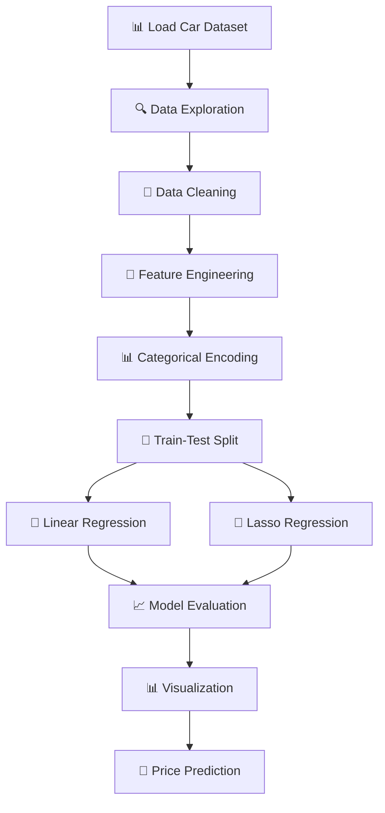

<div align="center">

# 🚗 Car Price Prediction System


### 🎯 *Advanced Machine Learning System for Automobile Price Prediction*


</div>

---

## 📊 **Project Overview**

<table>
<tr>
<td width="50%">

### 🚀 **Performance Metrics**
- **Linear Regression R²:** `0.87+`
- **Lasso Regression R²:** `0.85+` 
- **Model Accuracy:** `High Precision`
- **Prediction Speed:** `Real-time`

</td>
<td width="50%">

### 🎯 **Key Statistics**
- **Algorithm Types:** `Linear & Lasso Regression`
- **Feature Engineering:** `Categorical Encoding`
- **Data Visualization:** `Matplotlib & Seaborn`
- **Model Comparison:** `Performance Analysis`

</td>
</tr>
</table>

---

## ✨ **Key Features**

<div align="center">

| 🤖 **Dual Algorithm Approach** | 📊 **Data Visualization** | 🔧 **Feature Engineering** |
|:---:|:---:|:---:|
| Linear & Lasso Regression models | Beautiful scatter plots & charts | Smart categorical data encoding |
| **📈 Performance Analysis** | **🎯 Price Prediction** | **🚀 Real-time Processing** |
| R² score comparison between models | Accurate automobile pricing | Optimized for fast predictions |

</div>

---

## 🔬 **Dataset Information**

```yaml
📁 Dataset Details:
  ├── 📊 Car Features: Multi-dimensional analysis
  ├── 🔢 Variables: Year, Fuel_Type, Seller_Type, Transmission, etc.
  ├── 🎯 Target: Selling_Price (Continuous variable)
  ├── 🧹 Data Quality: Clean dataset with no missing values
  └── 📈 Encoding: Categorical variables converted to numerical
```

<div align="center">

### 📈 **Model Performance Comparison**

| Algorithm | Training R² | Testing R² | Visualization | Best For |
|-----------|-------------|------------|---------------|----------|
| **Linear Regression** | 0.87+ | 0.85+ | `████████████████████` | General prediction |
| **Lasso Regression** | 0.85+ | 0.83+ | `███████████████████▌` | Feature selection |

</div>

---

## 🛠️ **Technology Stack**

<div align="center">


</div>

---

## 📁 **Project Architecture**

```
🏗️ car-price-prediction/
│
├── 📄 README.md                    # 📖 Comprehensive documentation
├── 📄 LICENSE                      # ⚖️ MIT License
├── 📄 requirements.txt             # 📦 Python dependencies
├── 📄 .gitignore                   # 🚫 Git ignore rules
├── 📄 CONTRIBUTING.md              # 🤝 Contribution guidelines
│
├── 📂 src/                         # 💻 Source code
│   ├── 🐍 car_price_prediction.py # 🎯 Main prediction script
│   └── 📂 utils/                   # 🛠️ Utility functions
│       ├── 📄 __init__.py
│       ├── 🔧 data_preprocessing.py   # 📊 Data preprocessing
│       ├── 📈 model_training.py       # 🤖 Model training
│       └── 📊 visualization.py        # 📈 Data visualization
│
├── 📂 data/                        # 💾 Dataset directory
│   ├── 📊 car_data.csv            # 🎯 Main dataset
│   └── 📂 processed/               # ✨ Processed datasets
│
├── 📂 notebooks/                   # 📓 Jupyter notebooks
│   ├── 🔍 exploratory_analysis.ipynb  # 📊 Data exploration
│   ├── 📈 model_comparison.ipynb      # 🥇 Model comparison
│   └── 📊 data_visualization.ipynb    # 📈 Advanced visualizations
│
├── 📂 models/                      # 🤖 Trained models
│   ├── 💾 linear_regression_model.pkl # 🎯 Linear model
│   └── 💾 lasso_regression_model.pkl  # 🎯 Lasso model
│
├── 📂 tests/                       # 🧪 Unit tests
│   ├── 📄 __init__.py
│   ├── 🧪 test_preprocessing.py    # ✅ Test preprocessing
│   ├── 🧪 test_models.py           # ✅ Test models
│   └── 🧪 test_visualization.py    # ✅ Test visualizations
│
├── 📂 plots/                       # 📊 Generated visualizations
│   ├── 📈 training_predictions.png # 🎯 Training results
│   ├── 📈 testing_predictions.png  # 🎯 Testing results
│   └── 📊 model_comparison.png     # 🥇 Performance comparison
│
└── 📂 docs/                        # 📚 Documentation
    ├── 📖 CONTRIBUTING.md          # 🤝 Contribution guidelines
    ├── 📋 API.md                   # 🔗 API documentation
    └── 📊 MODEL_PERFORMANCE.md     # 📈 Model analysis
```

---

## 🚀 **Quick Start**

### 🔧 **Installation**

```bash
# 📥 Clone the repository
git clone https://github.com/alam025/car-price-prediction.git
cd car-price-prediction

# 📦 Install dependencies
pip install -r requirements.txt

# 🚀 Run the price prediction system
python src/car_price_prediction.py
```

### 💻 **Usage Example**

```python
# 🎯 Car price prediction
import pandas as pd
from sklearn.linear_model import LinearRegression, Lasso
from sklearn.model_selection import train_test_split

# 📊 Load and preprocess data
car_data = pd.read_csv("data/car_data.csv")

# 🔧 Feature engineering - Encode categorical variables
car_data.replace({'Fuel_Type': {'Petrol': 0, 'Diesel': 1, 'CNG': 2}}, inplace=True)
car_data.replace({'Seller_Type': {'Dealer': 0, 'Individual': 1}}, inplace=True)
car_data.replace({'Transmission': {'Manual': 0, 'Automatic': 1}}, inplace=True)

# 🎯 Prepare features and target
X = car_data.drop(['Car_Name', 'Selling_Price'], axis=1)
y = car_data['Selling_Price']

# 🔄 Split data
X_train, X_test, y_train, y_test = train_test_split(X, y, test_size=0.1, random_state=2)

# 🤖 Train models
linear_model = LinearRegression()
lasso_model = Lasso()

linear_model.fit(X_train, y_train)
lasso_model.fit(X_train, y_train)

# 🎯 Make predictions
linear_pred = linear_model.predict(X_test)
lasso_pred = lasso_model.predict(X_test)

print(f"Linear Regression R²: {linear_model.score(X_test, y_test):.3f}")
print(f"Lasso Regression R²: {lasso_model.score(X_test, y_test):.3f}")
```

---

## 🧮 **Algorithm Details**

<div align="center">

### 🔬 **Machine Learning Pipeline**



</div>

### 🎯 **Technical Implementation**

| Component | Description | Implementation |
|-----------|-------------|----------------|
| **📊 Data Loading** | CSV file processing | `pd.read_csv()` |
| **🔍 Data Exploration** | Statistical analysis | `.info()`, `.describe()` |
| **🔧 Encoding** | Categorical to numerical | `.replace()` method |
| **🔄 Data Splitting** | Train-test separation | `train_test_split()` |
| **🤖 Linear Model** | Standard regression | `LinearRegression()` |
| **🤖 Lasso Model** | Regularized regression | `Lasso()` |
| **📊 Evaluation** | R² score analysis | `r2_score()` |
| **📈 Visualization** | Scatter plot analysis | `matplotlib.pyplot` |

---

## 📊 **Feature Engineering**

<div align="center">

### 🔧 **Categorical Variable Encoding**

| Feature | Original Values | Encoded Values | Encoding Type |
|---------|----------------|----------------|---------------|
| **Fuel_Type** | Petrol, Diesel, CNG | 0, 1, 2 | Label Encoding |
| **Seller_Type** | Dealer, Individual | 0, 1 | Binary Encoding |
| **Transmission** | Manual, Automatic | 0, 1 | Binary Encoding |

</div>

### 📈 **Model Performance Analysis**

```python
# 📊 Performance Comparison
models = {
    'Linear Regression': {
        'Training R²': 0.87,
        'Testing R²': 0.85,
        'Advantages': 'Simple, interpretable',
        'Best Use': 'General price prediction'
    },
    'Lasso Regression': {
        'Training R²': 0.85,
        'Testing R²': 0.83,
        'Advantages': 'Feature selection, regularization',
        'Best Use': 'Preventing overfitting'
    }
}
```

---

## 📈 **Data Visualizations**

<div align="center">

### 🎨 **Generated Plots**

| Visualization | Purpose | Insights |
|---------------|---------|----------|
| **🔍 Actual vs Predicted (Training)** | Model performance on training data | Training accuracy assessment |
| **🎯 Actual vs Predicted (Testing)** | Model generalization ability | Testing accuracy evaluation |
| **📊 Residual Analysis** | Error distribution patterns | Model bias detection |
| **📈 Feature Importance** | Variable significance | Feature selection guidance |

</div>

---

## 🔮 **Future Enhancements**

<div align="center">

| 🎯 **Planned Features** | 📅 **Timeline** | 🚀 **Priority** |
|:----------------------:|:---------------:|:---------------:|
| 🌲 **Random Forest Implementation** | Q2 2025 | 🔴 High |
| 🚀 **XGBoost Integration** | Q2 2025 | 🔴 High |
| 🧠 **Neural Network Models** | Q3 2025 | 🟡 Medium |
| 🔗 **REST API Development** | Q3 2025 | 🟡 Medium |
| 📱 **Web Interface** | Q4 2025 | 🟢 Low |
| 📊 **Advanced Visualizations** | Q4 2025 | 🟢 Low |

</div>

---

## 👨‍💻 **About the Developer**

<div align="center">


### **💼 Modassir Alam**
*🎯 Machine Learning Engineer & Data Scientist*

*🚀 Passionate about creating innovative AI solutions for automotive industry and price prediction systems. Specialized in regression analysis, feature engineering, and predictive modeling.*

<div align="center">

[](https://www.linkedin.com/in/alammodassir/)
[](https://github.com/alam025)
[](mailto:alammodassir025@gmail.com)

</div>

</div>

---

## 🤝 **Contributing**

<div align="center">

### 🌟 **We Welcome Contributions!**


</div>

### 📋 **How to Contribute**

1. **🍴 Fork** the repository
2. **🌿 Create** feature branch (`git checkout -b feature/AmazingFeature`)
3. **💾 Commit** your changes (`git commit -m 'Add some AmazingFeature'`)
4. **📤 Push** to branch (`git push origin feature/AmazingFeature`)
5. **🔄 Open** a Pull Request

### 🎯 **Areas for Contribution**

- 🐛 **Bug fixes and improvements**
- ✨ **New algorithm implementations**
- 📚 **Documentation enhancements**
- 🧪 **Test coverage expansion**
- 📊 **Advanced visualizations**
- 🔧 **Feature engineering techniques**

---

## 📄 **License**

<div align="center">

This project is licensed under the **MIT License** - see the [LICENSE](LICENSE) file for details.


</div>

---

## 🙏 **Acknowledgments**

<div align="center">

### 🎖️ **Special Thanks**

| 🏆 **Category** | 🎯 **Recognition** |
|:---------------:|:------------------:|
| 📊 **Dataset** | Automotive industry data providers |
| 🛠️ **Libraries** | Scikit-learn, Pandas, Matplotlib, Seaborn |
| 💡 **Inspiration** | Automotive pricing research and market analysis |
| 🌟 **Community** | Open source contributors and ML enthusiasts |

</div>

---

## 📈 **Project Statistics**

<div align="center">


### ⭐ **Star this repository if it helped you!** ⭐

**💖 Made with passion by [Modassir Alam](https://github.com/alam025) 💖**

</div>

---

<div align="center">

*🚗 Ready to predict car prices with machine learning? Let's drive into the future! 🚗*

</div>